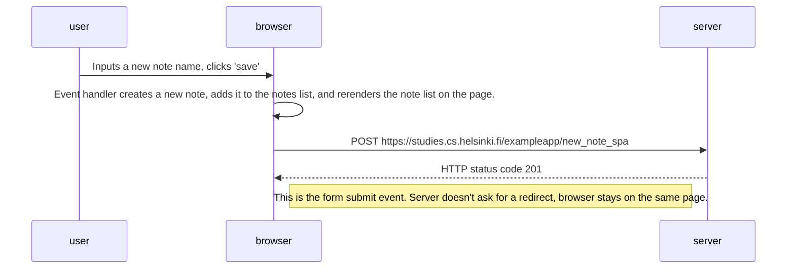

```mermaid
sequenceDiagram

    participant user
    participant browser
    participant server

    user->>browser: Inputs a new note name, clicks 'save'

    browser->>browser: Event handler creates a new note, adds it to the notes list, and rerenders the note list on the page.

    browser->>server: POST https://studies.cs.helsinki.fi/exampleapp/new_note_spa
    server-->>browser: HTTP status code 201
    Note right of browser: This is the form submit event. Server doesn't ask for a redirect, browser stays on the same page.
```
