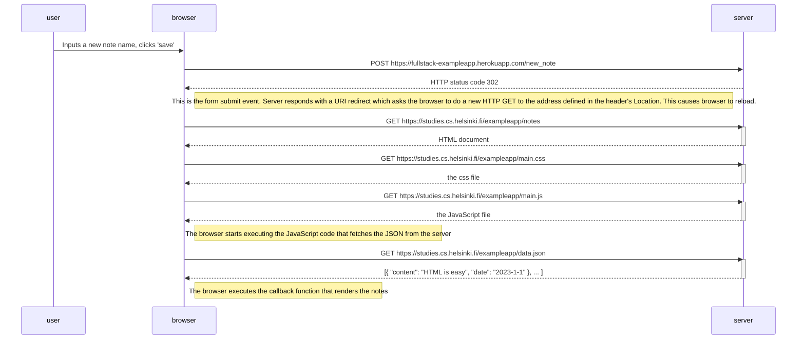

```mermaid
sequenceDiagram

    participant user
    participant browser
    participant server

    user->>browser: Inputs a new note name, clicks 'save'

    browser->>server: POST https://fullstack-exampleapp.herokuapp.com/new_note
    server-->>browser: HTTP status code 302
    Note right of browser: This is the form submit event. Server responds with a URI redirect which asks the browser to do a new HTTP GET to the address defined in the header's Location. This causes browser to reload.

    browser->>server: GET https://studies.cs.helsinki.fi/exampleapp/notes
    activate server
    server-->>browser: HTML document
    deactivate server

    browser->>server: GET https://studies.cs.helsinki.fi/exampleapp/main.css
    activate server
    server-->>browser: the css file
    deactivate server

    browser->>server: GET https://studies.cs.helsinki.fi/exampleapp/main.js
    activate server
    server-->>browser: the JavaScript file
    deactivate server

    Note right of browser: The browser starts executing the JavaScript code that fetches the JSON from the server

    browser->>server: GET https://studies.cs.helsinki.fi/exampleapp/data.json
    activate server
    server-->>browser: [{ "content": "HTML is easy", "date": "2023-1-1" }, ... ]
    deactivate server

    Note right of browser: The browser executes the callback function that renders the notes
```
